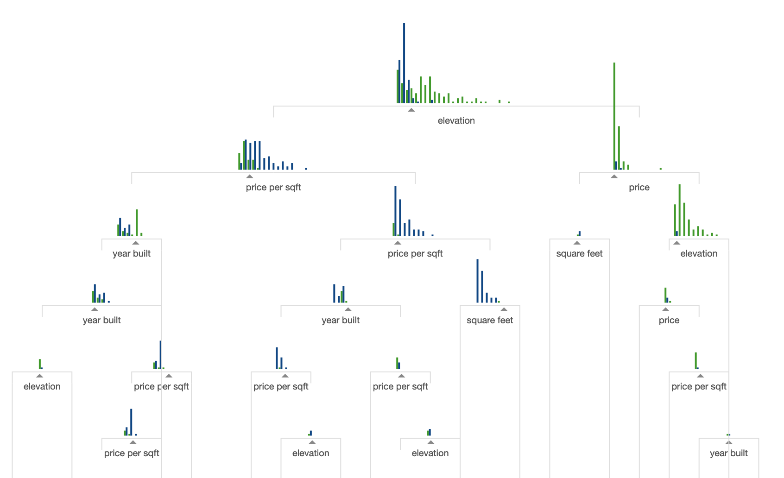

```{r, message=FALSE, echo=FALSE}
source("../funs/funs.R")
options(dsst.traceit = FALSE)
```

# Load the Data

As in the previous notes, I will use the Amazon product classification task.
We will read in the `docs` and `anno` tables:

```{r, message = FALSE}
docs <- read_csv("../data/amazon_product_class.csv")
anno <- read_csv("../data/amazon_product_class_token.csv.gz")
```

Today, we are going to derive a different type of local model called a gradient
boosted trees (GBTs) or gradient boosted machine (GBMs). [Confusingly, the first
term is far more common whereas the second abbreviation is more far more
popularion.] I have some prose notes below, but in the class we will mostly
follow these slides:

- [slides](../extra/gbm.pdf)

## Decision Trees

Before we get to the main model today, we need to understand an intermediate
model called a *decision tree*. There is no good R package for running simple
decision trees for multiclass regression, so we will not actually run this
model in R. Instead, we will just discuss how the model works.

Consider a single model feature such as the frequency of a single particular
word. For some cutoff value v, we can split the entire dataset into two parts:
data less than v and data greater than v. Within each of these two parts, we
could assign each observation a prediction based on the most common category in
the training data of each side. By measuring how well this split of the data
improves our ability to make predictions, we can categorize how good a
particular split is.

A decision tree starts by considering all possible split values for all of the
features. It then picks the best split and groups the data into two buckets
based on this most predictive split. Then, it recursively splits each of these
subgroups further by finding the best second splits from all possible options.
This continues until some stopping criterion is reached (minimum improvement,
maximum depth, maximum splits, etc.). The resulting model has the data split
into N buckets, with each bucket being given the average value of the training
data in each bucket. This seems numerically very complicated, but there are a
variety of tricks to speed up the process.

The final form of a decision tree looks something like this:



It is an adaptive form of KNN. In affect, we are using the training data to
decided how to measure which points are close to one another rather than using
Euclidean distance directly.

If you want to see a longer visualisation of decision trees, I suggest checking
out
[A visual introduction to machine learning](http://www.r2d3.us/visual-intro-to-machine-learning-part-1/).
It has the benefit of giving great visual intuition for the model as well as
reviewing some key machine learning concepts.

## Gradient Boosted Trees

An individual decision tree is often not a particularly powerful model for
complex prediction tasks. A clever way to increase the predictive power of
a decision tree is to build a large collection of trees; prediction is then
done by predicting on each individual tree and taking the majority class across
the whole set. One such model is called a *random forest*. The one that we will
look at here is a *gradient boosted tree*, or *gradient boosted machine* (GBM).
The algorithm works like this:

- select a random subset of the training data
- build a decision tree with the selected training data to predict the labels
- take the probabilities from this first tree, multiply by a fixed parameter
called the *learning rate* (say, 0.01), and compute the how well the model
is able to make predictions
- take another random subset of the training data
- building a decision tree with the selected training data to predict updates
to the probabilities from this model
- repeat this process many times

## Gradient Boosted Trees in R

To run gradient boosted trees, we will use the package **xgboost**, which has
a very fast implementation of a learning algorithm. I have wrapped up the
package's functions in a consistent way so that we can call it using the
function `dsst_gbm_build`. The key parameters to set are the number of rounds
(or trees) and the learning rate. As always, some trial and error is needed to
get a good result. Note that in general, more trees are needed for a smaller
learning rate.

```{r}
model <- dsst_gbm_build(anno, docs, nrounds = 300, eta = 0.01)
```

Let's see how well this model predicts the classes in our data (in RStudio, the
error rates will print out as you build the model):

```{r}
dsst_erate(model)
```

It manages about 10%, significantly better than the KNN model we built in the
previous class and only slightly worse than the penalized regression model.

In addition to generally being faster and making better predictions, one
benefit of the gradient boosted trees over KNN is that it provides variable
importance scores:

```{r}
dsst_gbm_imp(model)
```

Unlike global models, there is no clear concept of which class is associated
with a particular term. In fact, the model may not even more exactly in a
linear fashion that way. However, we are able to see many of the same terms
as in the elastic net model.

## Thoughts on local models

We will continue to make the heaviest use of regression-based models, but
the two local models we have seen (particularly gradient boosted trees)
will be useful to augment these, particularly when looking at features that
benefit from determining interaction terms, such as part of speech N-grams.
In machine learning competitions, particularly those on non-image and
non-textual data, gradient boosted trees are very often the winning model.
They can, however, take a bit of tuning to get the best results. Usually this
consists in slowly lowering the learning rate and increasing the number of
trees until the model *saturates* (no longer improves).

Here is an example in which I tuned the model to have a much lower learning rate
and larger number of trees:

```{r}
model <- dsst_gbm_build(anno, docs, nrounds = 2000, eta = 0.005)
```

It ends up being slightly more predictive than the model we had for the best
elastic net model:

```{r}
dsst_erate(model)
```

Though, practically speaking, the differences are fairly minor they can be
quite different when working with other prediction tasks and feature sets.
