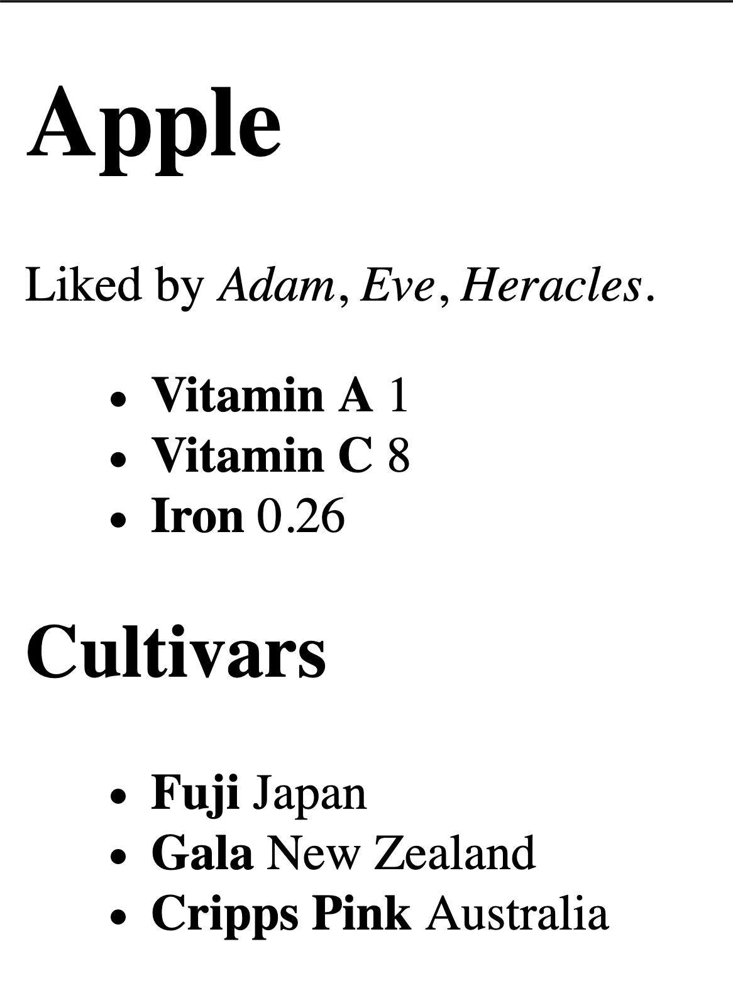

```{r, include=FALSE}
source("../funs/funs.R")
options(dsst.traceit = FALSE)
```


# HTML and XML

## XML Format

XML (Extensible Markup Language) is a popular format for transfering
and storing data. As with JSON data, the format is quite flexible and
typically results in nested, tree-like structures that require some
work to turn into a rectangular data format. Much of the formal
standards for XML are concerned with describing how other groups can
produce specific "extensible" dialects of XML that have consistent
names and structures to describe particular kinds of data. Popular
open examples include XML-RDF (Resource Description Framework) for describing
linked open data and XML-TEI (Text Encoding Initiative) for providing
context to textual data.

In short, XML organizes data inside of hierarchically nested tags. Tags
start with the `<` sign and end with the `>` sign. A start-tag such as
`<section>` is closed by a corresponding end-tag with a slash after the
`<`, such as `</section>`.  Tags can additionally have an arbiratry number
of name-value pairs called attributes.

Here is an example of one way the apple data that was stored in JSON in
the previous notes could be stored as an XML file.

```
<?xml version="1.0" encoding="UTF-8"?>
<root>
  <food>
    <name>Apple</name>
    <nutrition>
      <item name="Vitamin A">1</item>
      <item name="Vitamin C">8</item>
      <item name="Iron">0.26</item>
    </nutrition>
    <likes>
      <person>Adam</person>
      <person>Eve</person>
      <person>Heracles</person>
    </likes>
    <cultivars>
      <cultivar name="Fuji" location="Japan"></cultivar>
      <cultivar name="Gala" location="New Zealand"></cultivar>
      <cultivar name="Cripps Pink" location="Australia"></cultivar>
    </cultivars>
  </food>
</root>
```

The first line of the XML file here is called the *prolog* it is optional
but will usually be included. Note that there must be a single tag that
contains all of the data. Here this tag is called "root", which is a
relatively common name for the containing tag, but it may be called
something else dependending on the source.

## HTML Format

HTML (Hypertext Markup Language) is a markup language for describing documents
intended to be shown in a web browser. The purpose of HTML is not to store
arbirary data, but is instead focused on organizing the elements that are
going to be displayed on a website. However, it is frequently the case that
data scientists need to collect data that was originally intended to be shown
or used through a browser. Therefore, it will be useful to learn how to
parse these documents.

Strictly speaking, HTML is not an extension of XML. However, the two formats
look quite similar. They are both built from tags styled around angled braces
with optional attributes. It will turn out that the formats are similar
enough that we can use the same tools for parsing both XML and HTML data.
Here is an example of an HTML file containing information:

```
<!DOCTYPE html>
<html lang="en">
<head>
  <title>Food Items</title>
</head>
<body>
  <h1>Apple</h1>
  <div id="liked" class="info">
    <p>Liked by <i>Adam</i>, <i>Eve</i>,  <i>Heracles</i>.</p>
  </div>
  <div id="nutrition" class="info box">
    <ul>
      <li><b>Vitamin A</b> 1</li>
      <li><b>Vitamin C</b> 8</li>
      <li><b>Iron</b> 0.26</li>
    </ul>
  </div>
  <div id="cultivars" class="info box">
    <h2>Cultivars</h2>
    <ul>
      <li><b>Fuji</b> Japan</li>
      <li><b>Gala</b> New Zealand</li>
      <li><b>Cripps Pink</b> Australia</li>
    </ul>
  </div>
</body>
</html>
```

Different browsers will have different ways of displaying this HTML page.
Here is what it looks like in a current version of Firefox:



Unlike XML, HTML is meant for a specific purpose and the set of allowed
tags and their intended meanings are fixed by the standard. It is helpful
to be familiar with some of the most common tags. Some tags that are
particularly useful for working with webpages as data are:

- `<p>`: encloses a paragraph
- `<a>`: a link; URL is stored in the attribute "href"
- ``: an image; URL is stored in the attribute "src"
- `<ul>` and `<ol>`: ordered and unordered lists
- `<li>`: items within an unordered list
- `<h1>` through `<h6>`: headers of decreasing size
- `<div>`: used as a generic organizing object for components of a site
- `<span>`: used to wrap small inline elements of text and images
- `<table>`: a table of data
- `<tr>`: table row; contained within a table element
- `<td>`: table data; a specific cell in a table, usually inside of `<tr>`
- Various markup tags: `<b>` (bold), `<i>` (italics), `<emph>` (emphasis)

There are also a set of pre-defined attributes that are associated with
nodes in an HTML document. There are three common types that are particularly
useful to be aware of when extracting data from an HTML document:

- **id**: an identifier for the element; in theory this should be unique
- **class**: one or more class names (separated by a space); each of these
correspond to a set of default style values
- **style**: contains CSS markup to describe how the element should look

If you have not seen HTML data before, that is a lot of detail to take in all
at once. There is no need to become an expert in HTML coding in order to use
the methods in these notes. These codes are attributes are listed here only
to help in becoming familiar with elements that may arise when converting
HTML into tabular data for analysis.

## Parsing

The **xml2** package provides several powerful functions for working with XML
and HTML inputs. As with JSON data, reading an XML file into R is relatively
straightforward. Passing a filename to `read_xml` returns a special type of
object defined by the **xml2** package called an `xml_document`.

```{r, message=FALSE}
library(xml2)

obj_xml <- read_xml("../data/apple.xml")
obj_xml
```

We can convert the xml document into an R list by using the `as_list` function. The
resulting object is similar to the list returned after parsing a JSON file. Namely,
we have a collection of embedded lists with names determined by the names of the
containing tags. For example, the outer value has only one element named "root":

```{r}
names(as_list(obj_xml))
```

We can drill down into the dataset to get to to the elements that are contained
inside of the food element, which are called the *children* of the food node:

```{r}
names(as_list(obj_xml)$root$food)
```

The **xml2** package needs to also store the XML tag attributes somewhere in the
resulting list object. Fortunately, the R programming language also has the concept
of an attribute, which can be attached to any object type. The attributes of an
XML tag are, then, stored as R attributes within each node. For example, if we
print out the Vitamin A nutrition information we have both the value "1" and the
attribute of the name:

```{r}
vitamin_a <- as_list(obj_xml)$root$food$nutrition[[1]]
vitamin_a
```

To grab an attribute in R, we use the `attr` function with the object as the first
argument and the name of the attribute as the second object.

```{r}
attr(vitamin_a, "name")
```

Notice that the nutrition value of Vitamin A is stored as a string. Unlike JSON, XML
data has no native way of differentiating between numbers and strings. We will need
to manually convert numbers with `as.numeric` before storing numeric data contained
within an XML file.

An HTML file can be read into R with a similar function called `read_html`. The
object type is called an `html_document`, but for the most part it can be used
exactly the same as an XML document.

```{r}
obj_html <- read_html("../data/apple.html")
obj_html
```

For example, we can convert the object to a list, which yields a nested
collection of lists with names and attributes.

```{r}
names(as_list(obj_html)$html)
```

In general, trying to pick apart an XML or HTML file using the list format is
much more difficult that working with JSON data. Elements of lists that are
created from JSON either correspond to ordered arrays without names or are
name-value pairs with unique names. In XML and HTML it is possible, and quite
common, to have a list with meaningful names that are repeated many times.
Another complication is that the text markup can also be stored as tags, and
this requires some additional (non-trivial) cleaning in order to access all
of the text within a parent node.

Fortunately, there is another way to interact with XML and HTML data that
will solve many of these challenges.

## XML Path Language (XPath)

One of the best features about XML data is the existance of the Xpath
language for describing a way of searching for particular nodes within
an XML document. The XPath language is similar to a regular expression
language, but rather than describing string patterns it is used for
finding nodes based on their relations, names, and attributes.

The function `xml_find_all` can be used to apply an XPath expression to
an XML or HTML document. The first argument is the document object (note
that we are not applying the `to_list` function here) and the second
argument is a string describing the XPath search query. Usually, we
start a search query with ".//" to indicate that we are looking for
a pattern that can occur anywhere in a document. Then, we can follow
this with the tag name that we are looking to find. For example,
here is a search for all of the tags that look like `<b>` (bold text)
in the HTML document:

```{r}
xml_find_all(obj_html, ".//b")
```

We see that the query has found the six bold blocks of text on the page.
The returned results are a special kind of object called an `xml_nodeset`.
To get the text contained within the nodes as an R vector, we can wrap
the output in the function `xml_text`:

```{r}
xml_text(xml_find_all(obj_html, ".//b"))
```

XPath also allows us to search for a sequence of nested nodes. This
is done by following the first node name by a `/`. For example, here
are all of the li tags (list item) that are contained within un tags
(unordered list) that are contained a div object.

```{r}
xml_find_all(obj_html, ".//div/ul/li")
```

The `xml_text` function, applied to the output here, takes care of removing
any internal tags that we do not want to both with. Here, for example are
the elements of all the text contained within the list items without the
bold (`<b>`) tags.

```{r}
xml_text(xml_find_all(obj_html, ".//div/ul/li"))
```

We can also specify a specific attribute for a node by following the
node name with square brackets and specific syntax. Here is the code
to only grab those list items instide unordered lists that are in a
div with the id of 'nutrition':

```{r}
xml_find_all(obj_html, ".//div[@id='nutrition']/ul/li")
```

XPath even allows for searching on a substring by use of the `contains`
function. This is particularly useful for the HTML class attribute, which
often contains multiple class values seperated by spaces. Here, we
search for any div that contains the class 'box'.

```{r}
xml_find_all(obj_html, ".//div[contains(@class, 'box')]")
```

In the XML document, there is important data contained within the attributes
of the Appled cultivars.

```{r}
xml_find_all(obj_xml, ".//cultivars/cultivar")
```

There is a function `xml_attr` that operates similarly to the R `attr` function
for accessing a specific attribute by name.

```{r}
xml_attr(xml_find_all(obj_xml, ".//cultivars/cultivar"), "name")
```

Finally, note that we can save the `xml_nodes` object and perform a sub-search
within the extracted nodes. This can be useful for creating complex datasets that
iteratively cycle through components of an XML or HTML tree.

```{r}
nodes <- xml_find_all(obj_html, ".//div[@id='nutrition']")
xml_find_all(nodes, ".//b")
```

With the help of XPath expressions and the functions `xml_text` and `xml_attr`,
parsing XML and HTML documents is made much easier.  In many ways, it can be
easier to parse data with these functions than parsing a similar JSON file,
particularly as the depth and complexity of the objects become large.

There are many other features of XPath, but the basic methods presented here
should handle a large number of cases. 


## CNN Lite: Top Stories

As an example of how we can use XML to parse data from a website, let's look at
the CNN "lite" website, a low-bandwidth version of their usual page. This will
give us an interesting but not too difficult example to work with. 

To start, we grab the webpage using the same functions as with but now set the
type argument of the content to indicate that the returned data is html.

```{r}
url_str <- modify_url("https://lite.cnn.com/en")
res <- dsst_cache_get(url_str, cache_dir = "cache")
obj <- content(res, type = "text/html", encoding = "UTF-8")
obj
```

We'll look at the source code of the page in my browser, which reveals that 
each story is in an li (list item) tag. Let's grab those:

```{r}
xml_find_all(obj, ".//li")
```

The text inside the tag gives a title for the story:

```{r}
xml_text(xml_find_all(obj, ".//li"))
```

And the "href" attribute tells us where to find the page with the full text:

```{r}
xml_attr(xml_find_all(obj, ".//li/a"), "href")
```

We can create a dataset of the top stories like this:

```{r}
top_stories <- tibble(
  title = xml_text(xml_find_all(obj, ".//li")),
  link = xml_attr(xml_find_all(obj, ".//li/a"), "href")
)

top_stories
```

## CNN Lite: Story Text

Let's now grab the text from the first story on the website. Here, we add the
link as the path, while setting the same protocol and authority as the main
page.

```{r}
url_str <- modify_url("https://lite.cnn.com/", path = top_stories$link[1])
url_str
```

Now, let's grab the page and once again parse it as HTML:

```{r}
res <- dsst_cache_get(url_str, cache_dir = "cache")
obj <- content(res, type = "text/html", encoding = "UTF-8")
obj
```

Looking at the source, we see that we can get post of the metadata by searching
for paragraph (p) tags with specific ids. In case there are duplicates, we will
use the `xml_find_first` function here to assure that only one record appears.

```{r}
meta <- tibble(
  title = xml_text(xml_find_first(obj, ".//h2")),
  byline = xml_text(xml_find_first(obj, ".//p[@id='byline']")),
  published = xml_text(xml_find_first(obj, ".//p[@id='published datetime']")),
  source = xml_text(xml_find_first(obj, ".//p[@id='source']")),
  note = xml_text(xml_find_first(obj, ".//p[@id='editorsNote']"))
)

meta
```

It will be helpful in a moment to have a unique id for each page. Let's use
some regular expressions for this:

```{r}
id <- stri_extract(top_stories$link[1], regex = "/[^/]+\\Z")
id <- stri_sub(id, 2, -1)
id
```

Finally, we can get the text of the article by searching for paragraph tags 
that do not have an id attribute:

```{r}
xml_find_all(obj, ".//p[not(@id)]")
```

And then, can put this into a tabular data table:

```{r}
para <- tibble(
  id = id,
  text = xml_text(xml_find_all(obj, ".//p[not(@id)]"))
)
para
```

Looking at the final rows, we can add a small tweak to remove the extra data 
at the bottom of the page.

```{r}
para <- tibble(
  id = id,
  text = xml_text(xml_find_all(obj, ".//div[not(@style)]/p[not(@id)]"))
)
para
```


## CNN Lite: Iteration

Let finish the notes we covered in class to grab all of the pages from CNN.
To start, recreate the top stories data:

```{r}
url_str <- modify_url("https://lite.cnn.com/en")
res <- dsst_cache_get(url_str, cache_dir = "cache")
obj <- content(res, type = "text/html", encoding = "UTF-8")

top_stories <- tibble(
  title = xml_text(xml_find_all(obj, ".//li")),
  link = xml_attr(xml_find_all(obj, ".//li/a"), "href")
)

top_stories
```

To speed things up, we will use only the first 10 stories but the code can be
easily changed to include all of them. Note that here we need to collect two
different tables, one for metadata and one for stories. The unique id created
above will help if we later want to put these tables together.

```{r}
n <- 10

output_meta <- vector("list", n)
output_para <- vector("list", n)
for (i in seq_len(n))
{
  # grab the story
  url_str <- modify_url("https://lite.cnn.com/", path = top_stories$link[i])
  res <- dsst_cache_get(url_str, cache_dir = "cache")
  obj <- content(res, type = "text/html", encoding = "UTF-8")

  # create id
  id <- stri_extract(top_stories$link[i], regex = "/[^/]+\\Z")
  id <- stri_sub(id, 2, -1)
  
  # create and store metadata 
  output_meta[[i]] <- tibble(
    title = xml_text(xml_find_all(obj, ".//h2")),
    byline = xml_text(xml_find_first(obj, ".//p[@id='byline']")),
    published = xml_text(xml_find_first(obj, ".//p[@id='published datetime']")),
    source = xml_text(xml_find_first(obj, ".//p[@id='source']")),
    note = xml_text(xml_find_first(obj, ".//p[@id='editorsNote']"))
  )
  
  # create and story story text
  output_para[[i]] <- tibble(
    id = id,
    text = xml_text(xml_find_all(obj, ".//div[not(@style)]/p[not(@id)]"))
  )
}

cnn_meta <- bind_rows(output_meta)
cnn_text <- bind_rows(output_para)
```

Which yields a metadata table:

```{r}
cnn_meta
```

And a table with all of the story text:

```{r}
cnn_text
```


